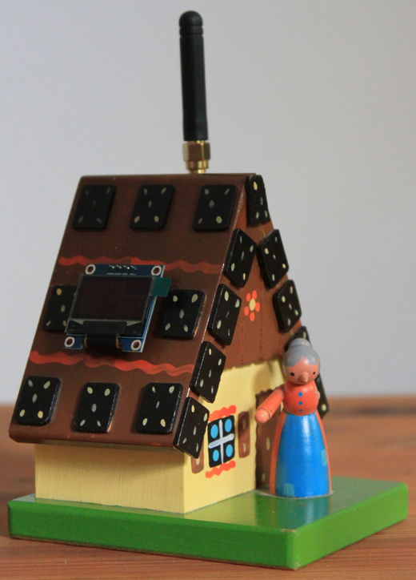
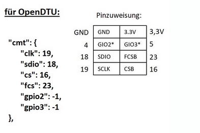
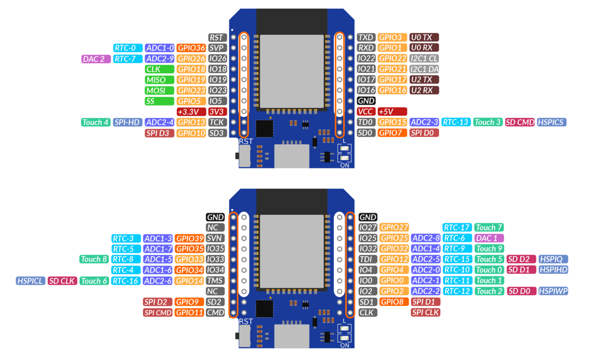
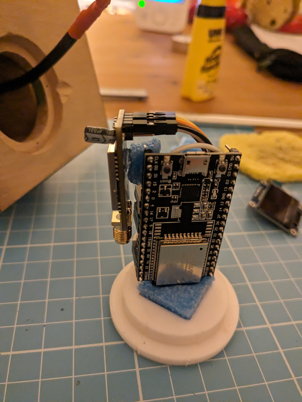
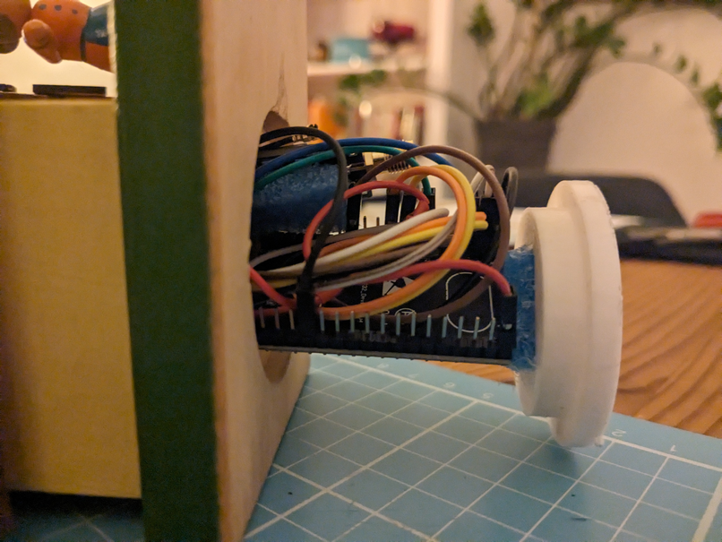
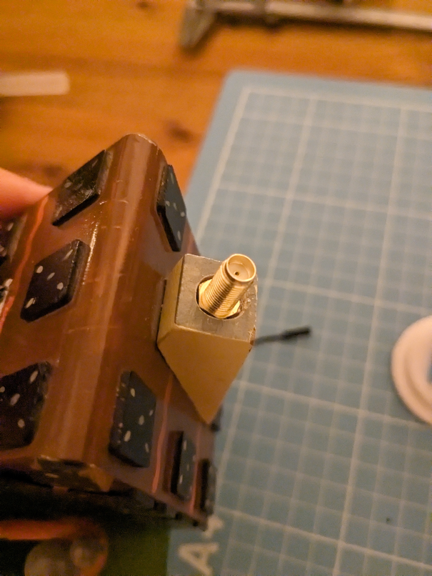
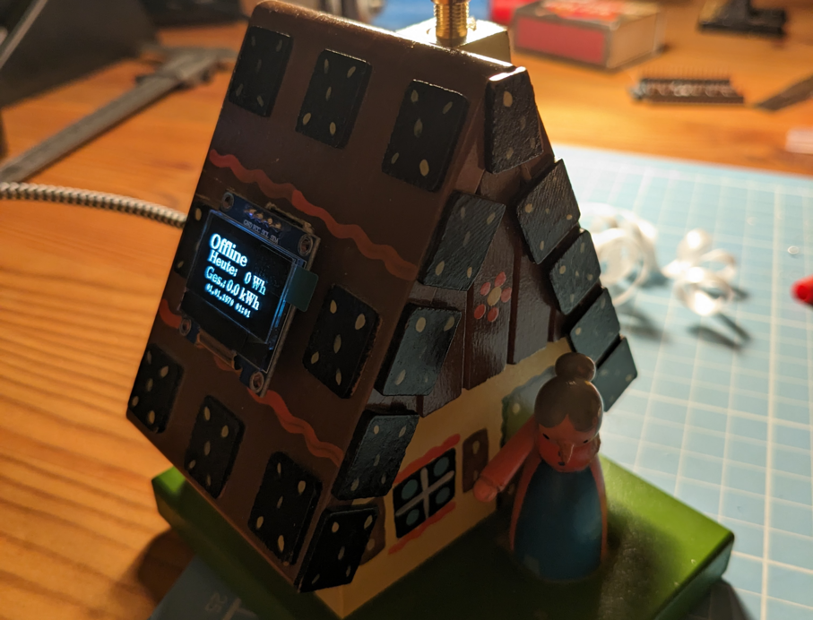
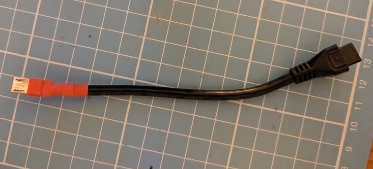

# Haisl

My in-laws bought some solar panels with hoymiles micro inverters. So I had no other choice but to build an [OpenDTU](https://github.com/tbnobody/OpenDTU/releases) based monitoring device from their large stack of (ore mountain) handicraft pieces:




# Shopping list

+ [ESP32 D1 Mini](https://www.az-delivery.de/products/esp32-d1-mini) (small form factor was key, two separate 3.3v lines would be better though)
+ [SSD1306 LCD](https://www.az-delivery.de/products/0-96zolldisplay?variant=26462805705)
+ [CMT2300A](https://www.ebay.de/itm/204669789785?var=505293150337)
+ [SMA pigtail](https://www.az-delivery.de/products/pigtail-koaxialkabel?_pos=1&_psq=sma+pigtail&_ss=e&_v=1.0)
+ dupont wire
+ very short micro usb-b extension cable to extend the esp32 port to the "case"

# Download and Flash

Get latest release of [OpenDTU](https://github.com/tbnobody/OpenDTU/releases) and `esptool.py`:

```
curl -LO https://github.com/tbnobody/OpenDTU/releases/latest/download/opendtu-generic_esp32.factory.bin
esptool.py --port /dev/ttyUSB0 --chip esp32 --before default_reset \
           --after hard_reset write_flash --flash_mode dout --flash_freq 40m --flash_size detect 0x0 \
           opendtu-generic_esp32.factory.bin
```


# Configure and Connect to OpenDTU wifi

```
nmcli device wifi rescan
ssid=$(nmcli -t device wifi list | grep -i opendtu | cut -d":" -f8)
nmcli con add con-name opendtu type wifi ssid $ssid wifi-sec.psk openDTU42 wifi-sec.key-mgmt wpa-psk
nmcli con up opendtu

firefox http://192.168.4.1/
```

# Configure OpenDTU

1. set admin password
2. set *actual* wifi to join
3. upload [profile](profiles/profile_haisl.json) as pin layout in configuration management
4. verify devices are present (display should show something, CMT2300A should be listed as configured in Info -> System)
5. configure mqtt
6. configure and sync ntp
7. check auto-update

# CMT 2300A Pin Layout

Use these to generate a device profile or use the one in [`profiles/`](profiles/)



# ESP32 Pin Layout



# Some notes about the build

An early version used ESP32 devkit, but it turned out to be too big for the "case":



The base was initially a metal hatch with a key hole, because the house served as a children's piggybank with a coin slot in the back. I 3D printed a [new base](img/sockel.FCStd) that is slightly larger in diameter than the hole so I could just wedge it into place without the need for any screws, nails or glue.



For an antenna (this is the CMT2300A / 800MHz antenna, not wifi) I drilled a hole in the chimney and glued a regular rp-sma/u.fl pigtail into it:



The ~ 1" SSD1306 is perfect as it looks like a solar panel, but the font is quite small (for the in-laws at least):



Biggest challenge actually was to find a short micro usb cable and **fit it** properly into the case to serve as a micro usb port. I did not want a fixed cable hanging out of the case all the time, so a usb extension was the way to go. I ended up singificantly triming down the 20cm cable and hot-glued the usb socket into the back of the house (not pictured, amounted to 75% of the complete project ;) )


